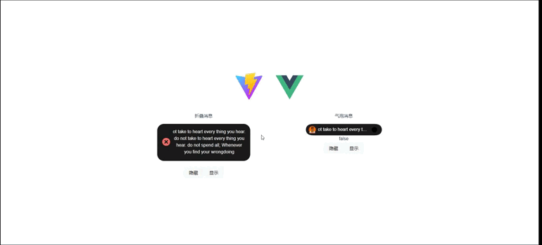

# js-dynamic-island

本仓库是消息提示交互动效,灵感来源于出色的IOS dynamic island的动画交互

## Install

```bash
$ npm i js-dynamic-island
```
## Quick Start
```javascript
import { BubbleMessage, FoldMessage, MessageBox } from 'js-dynamic-island'
import "../node_modules/js-dynamic-island/style.css";

BubbleMessage({
    user: 'zack',
    message: 'ot take to heart every thing you hear. do not take to heart every thing you hear. do not spend all; Whenever you find your wrongdoing',
    avatar: 'https://joeschmoe.io/api/v1/random',
    type: 'success'
})
FoldMessage({
    message: 'ot take to heart every thing you hear. do not take to heart every thing you hear. do not spend all; Whenever you find your wrongdoing',
    type: 'success'
})
MessageBox({
    title: 'This is a title',
    content: 'ot take to heart every thing you hear. do not take to heart every thing you hear. do not spend all; Whenever you find your wrongdoing'
}).then(() => {
    console.log('confirm')
}).catch(() => {
    console.log('cancel')
})
```
## API Docs
### BubbleMessage


| 参数      | 说明   | 类型     | 可选值           |
|---------|------|--------|---------------|
| user    | 用户名  | String | -             |
| message | 提示内容 | String | -             |
| avatar  | 用户头像 | String | -             |
| type    | 提示类型 | String | success/error |

### FoldMessage


| 参数      | 说明   | 类型     | 可选值           |
|---------|------|--------|---------------|
| message | 提示内容 | String | -             |
| type    | 提示类型 | String | success/error |

### MessageBox

    支持promise异步回调

| 参数      | 说明   | 类型     | 可选值 |
|---------|------|--------|-----|
| title   | 提示标题 | String | -   |
| content | 提示内容 | String | -   |
## License

js-dynamic-island is open source software licensed as MIT.